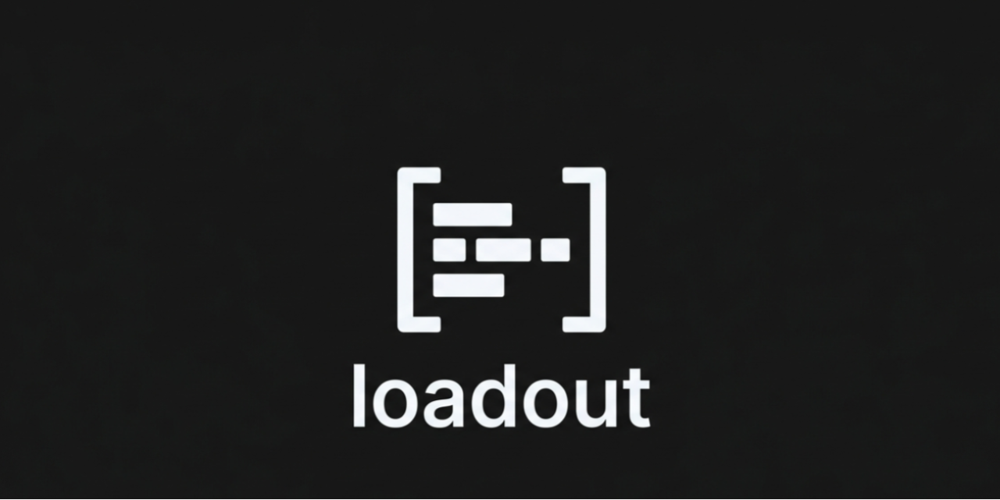

<p align="center">
  
</p>

<p align="center">
  A personalised Claude Code environment for your project.
</p>

--- Loadout runs a short
discovery interview, then generates a tailored set of rules, agents, commands,
skills, and hooks — all stored in your project's `.claude/` folder so Claude
picks them up automatically.

## Quick Start

```bash
# 1. Clone the repo
git clone https://github.com/Dmunslow/loadout.git
cd loadout

# 2. Install globally
./install.sh

# 3. Open any project and run
/new-loadout
```

That's it. The interview takes a few minutes, and at the end your project has
a fully configured Claude Code environment.

## What It Does

When you run `/new-loadout`, Loadout:

1. Creates a `project-context/` folder where you can drop reference material
2. Reads your codebase, README, git history, and any existing config
3. Walks you through a short conversation about your project, workflow, and preferences
4. Generates a complete `.claude/` configuration — rules, agents, commands, skills, and hooks

Everything is tailored to your project and how you work. No generic defaults,
no boilerplate you'll never use.

## Commands

After installing, these slash commands are available in any project:

| Command | What it does |
|---------|-------------|
| `/new-loadout` | Set up a new project loadout through a discovery interview |
| `/loadout-description` | See what's in your current project's loadout |
| `/update-rules` | Add, change, or remove rules conversationally |
| `/add-agent` | Create a new specialist agent for your project |
| `/remove-agent` | Remove an agent you no longer need |
| `/loadout-backup` | Snapshot your config before making changes |
| `/loadout-reset` | Remove loadout files from a project (backs up first) |
| `/loadout-doctor` | Check that the global installation is healthy |
| `/loadout-diff` | See what's changed in the repo since you last installed |
| `/update-loadout` | Pull the latest version from GitHub |

## How It Works

Loadout installs a small set of meta-tools into `~/.claude/` — the global
Claude Code config directory. These meta-tools (agents, commands, skills, and
rules) are what power the `/new-loadout` interview and all the management
commands above.

When you run `/new-loadout` in a project, those meta-tools generate
project-specific files in that project's `.claude/` folder. The global tools
and per-project output are completely separate:

```
~/.claude/                    ← Global: Loadout's meta-tools (installed once)
  agents/
  commands/
  rules/
  skills/

your-project/.claude/         ← Per-project: generated by /new-loadout
  agents/
  commands/
  rules/
  skills/
  hooks/
```

## Install / Uninstall

**Install:**

```bash
cd loadout
./install.sh
```

Copies Loadout's meta-tools into `~/.claude/`. Tracks everything in a manifest
so uninstall knows exactly what to remove. Records the version (git commit hash)
for update tracking.

**Uninstall:**

```bash
cd loadout
./uninstall.sh
```

Removes only the files Loadout installed globally. Does not touch any
project-level `.claude/` configurations.

**Update:**

```bash
# From within any project, run:
/update-loadout

# Or manually:
cd loadout
git pull
./install.sh
```

## Project Structure

```
loadout/
  .claude/
    agents/           Agents that power Loadout itself
    commands/         Slash commands installed globally
    rules/            Rules for Loadout's own behaviour
    skills/           Skills used during the discovery interview
  install.sh          Global installer
  uninstall.sh        Global uninstaller
```

## Acknowledgements

The Developer archetype is inspired by
[Everything Claude Code](https://github.com/affaan-m/everything-claude-code)
by Affaan Mustafa (MIT License).

## License

MIT
